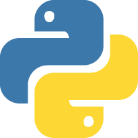

### Hi there, I'm Eric 👋

Now I'm working in Hangzhou as a Pythoner.

**Languages and Tools:**  

- **Front End**
  
  <code></code>
  <code></code>
  <code></code>
  <code></code>
  <code></code>
  <code></code>
  
- **Back End**

  <code></code>
  <code></code>
  <code></code>
  <code></code>
  <code></code>
  <code></code>
  <code></code>
  <code></code>
  <code></code>
  <code></code>
  
- **DataBase**

  <code></code>
  <code></code>
  <code></code>
  <code></code>
  <code></code>

 
